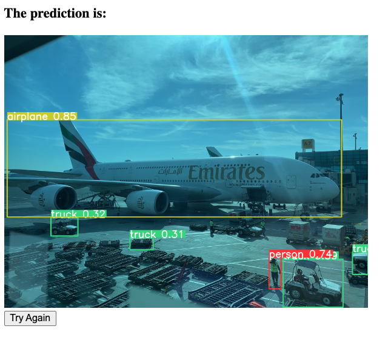
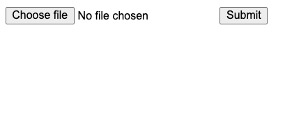

# MyYOLOv8 Detection API

## Introduction
This is a Flask-based REST API application that uses a pretrained YOLOv8 model to perform object detection on uploaded images.



## Requirements
- Python 3.8 or newer
- Flask 2.0.1 or newer
- OpenCV 4.5.2 or newer
- YOLOv8 (Ultralytics) - install via Ultralytics Github repository
- Pillow 8.2.0 or newer

You can install the necessary Python libraries using pip:
```shell
pip install flask opencv-python-headless pillow ultralytics
```
## Running the Application

You can run the application locally using the command:

```shell
python app.py
```
The application will be accessible at http://localhost:5002.
Alternatively, it is hosted at http://freshd.pythonanywhere.com to try it out. 

You will see a very minimal page where an image can be uploaded and submitted to perform image detection on it using YOLO.


## REST API Documentation

This application provides a REST API with the following endpoints:

### GET /
This endpoint displays an upload form where you can submit an image.

### POST /uploader
This endpoint accepts a POST request with a file upload. The uploaded file should be an image in a format that can be processed by OpenCV (for example, PNG or JPEG). The server will perform object detection on the uploaded image and return a new image with detected objects highlighted. The return image is displayed on a new page.
